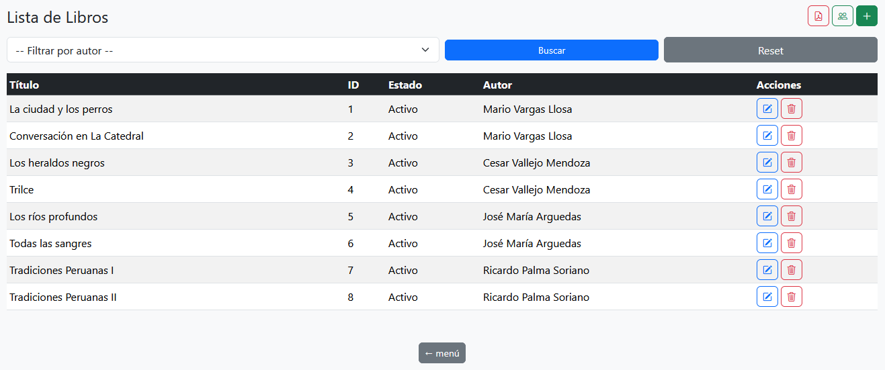
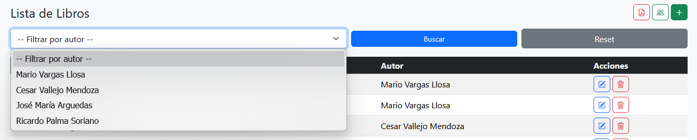
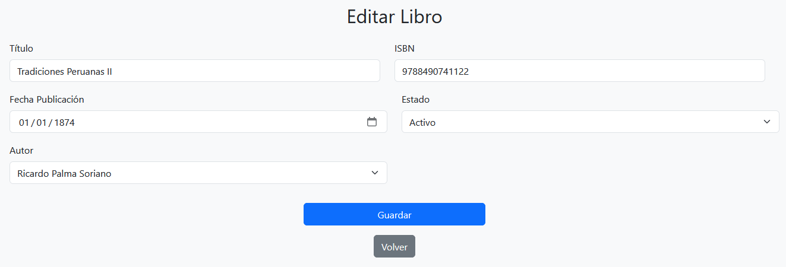
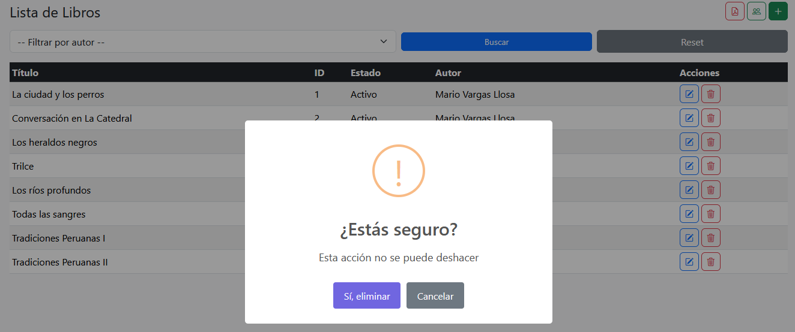

# 🎨 Biblioteca Frontend

Aplicación web desarrollada con Spring Boot y Thymeleaf para la gestión de autores y libros.  
Permite realizar operaciones CRUD completas, filtros y generación de reportes desde una interfaz web, consumiendo una API REST propia mediante RestTemplate.

Este proyecto fue diseñado siguiendo una arquitectura MVC (Modelo - Vista - Controlador), separando la capa de presentación del backend y orientado a interactuar con servicios externos.

---

## 🚀 Tecnologías utilizadas

- Java 17  
- Spring Boot  
- Thymeleaf  
- RestTemplate  
- Bootstrap 5  
- JavaScript  
- SweetAlert2  

---

## ⚙️ Cómo ejecutar el proyecto

1. Clonar el repositorio  
2. Abrir el proyecto en tu IDE (NetBeans, IntelliJ o Eclipse)  
3. Asegurarse de que el backend esté en ejecución  
4. Ejecutar la aplicación  

---

## 🌐 URL de acceso

- Backend API: http://localhost:8080/api
- Frontend: http://localhost:8081

---

## 🔗 Integración con Backend

El frontend consume una API REST desarrollada en Spring Boot mediante el uso de `RestTemplate`.

👉 Repositorio del backend:  
(Aquí debes colocar el link de tu API biblioteca-backend)

La comunicación permite realizar operaciones CRUD, aplicar filtros y generar reportes en PDF desde la interfaz web.

---

## 📌 Funcionalidades principales

### 🔹 Libros

- Crear libro  
- Listar libros  
- Editar libro  
- Eliminar libro  

---

### 🔹 Autores

- Crear autor  
- Listar autores  
- Editar autor  
- Eliminar autor  

---

### 🔹 Filtros

- Filtrar libros por autor  

---

### 🔹 Reportes

- Generación de reportes PDF  

---

## ⚠️ Manejo de interacción

El sistema utiliza SweetAlert2 para mostrar mensajes de confirmación, éxito y error durante las operaciones del usuario.

---

## 📸 Evidencia de funcionamiento

### 🔹 Lista de libros

### 🔹 Vista responsive (Autores - Mobile)

### 🔹 Filtro por autor (Mobile)

### 🔹 Filtro de libros (Desktop)

### 🔹 Formulario de libro

### 🔹 Formulario de autor (Mobile)

### 🔹 Confirmación de eliminación

### 🔹 Reporte PDF

---

## 🔄 Arquitectura

El sistema está dividido en dos componentes:

- Backend (API REST) → Maneja lógica de negocio y persistencia  
- Frontend (Thymeleaf) → Maneja la interfaz de usuario  

La comunicación se realiza mediante HTTP utilizando RestTemplate.

---

## 🔄 Mejoras en versión 1.0

Esta versión representa la implementación del frontend desacoplado del backend:

- Integración con API REST mediante RestTemplate  
- Implementación de vistas dinámicas con Thymeleaf  
- Formularios con binding directo al modelo  
- Validaciones en cliente con Bootstrap  
- Uso de SweetAlert2 para interacción con usuario  
- Diseño responsive adaptable a dispositivos móviles  

---